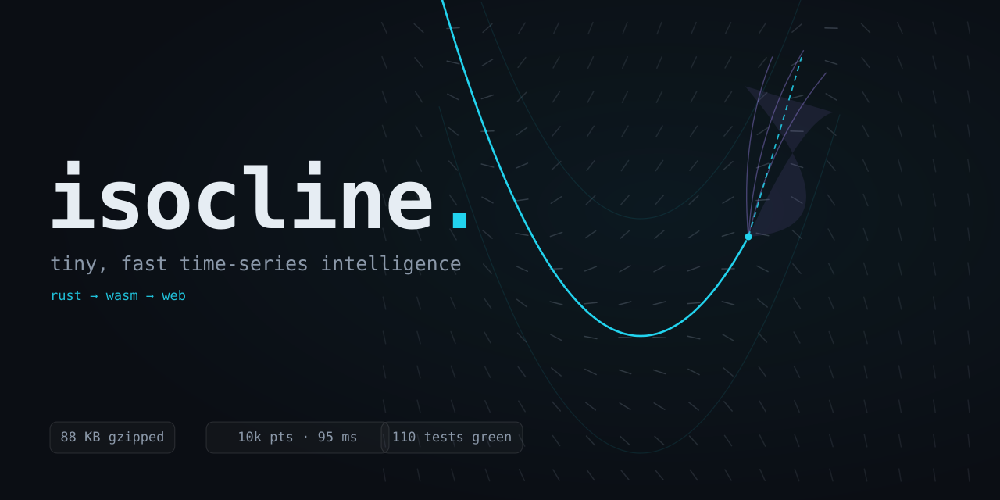
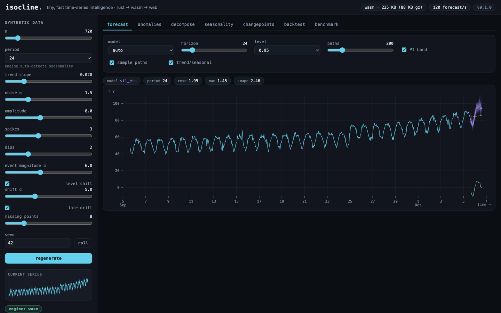
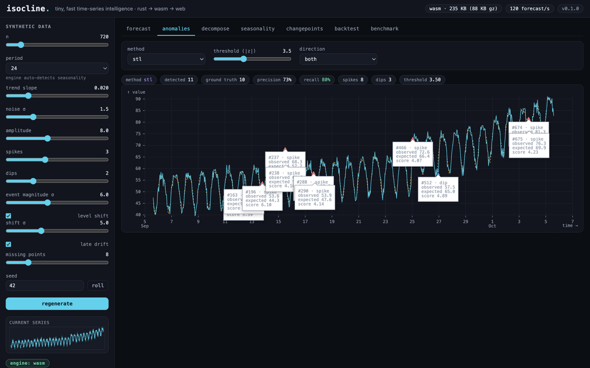
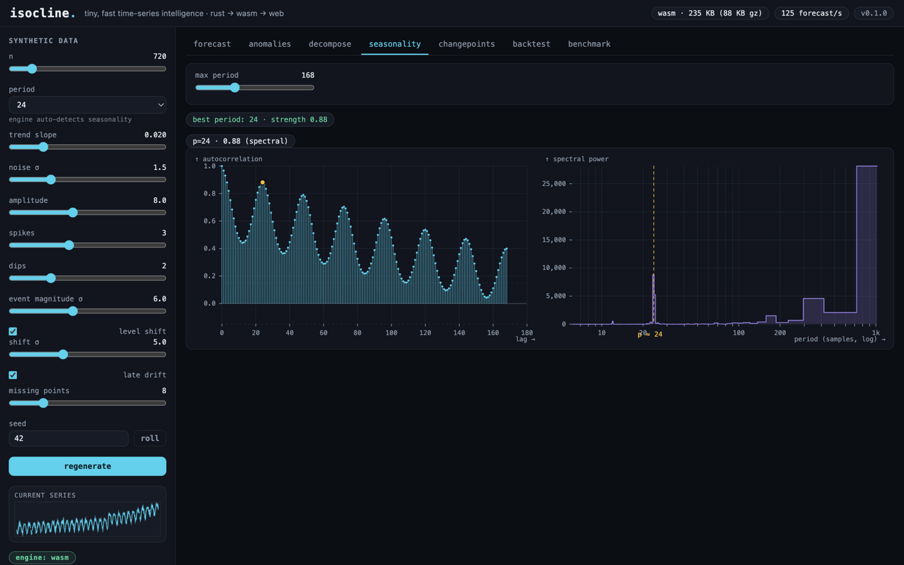
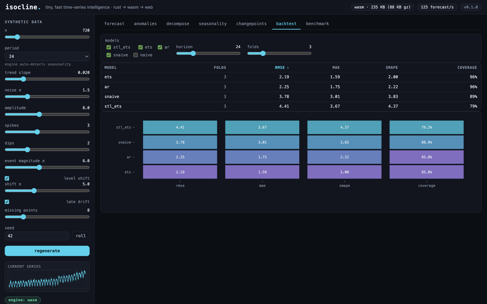
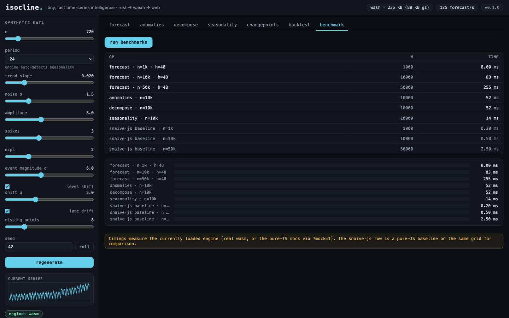
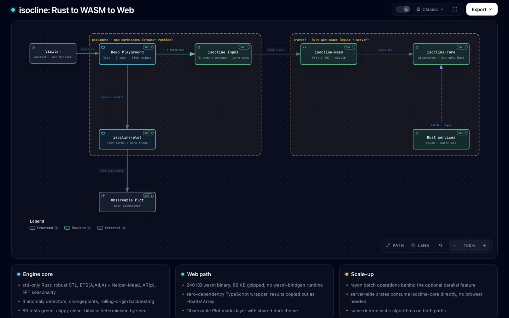

<p align="center">
  
</p>

# isocline

**Tiny, fast time-series intelligence - Rust → WASM → web.**

An augurs-style toolkit: a dependency-free Rust forecasting & anomaly-detection
core, compiled to a 240 KB (88 KB gzipped) WASM module with a zero-dependency
TypeScript wrapper, an [Observable Plot](https://github.com/observablehq/plot)
visualization layer, and an interactive demo.

**[Architecture diagram, live](https://www.eternalchaos.xyz/isocline/)** ([local copy](docs/architecture.html)) · **[Full showcase](docs/SHOWCASE.md)**

<p align="center">
  <a href="docs/SHOWCASE.md#forecast"></a>
  <a href="docs/SHOWCASE.md#anomaly-detection"></a>
  <br>
  <a href="docs/SHOWCASE.md#seasonality"></a>
  <a href="docs/SHOWCASE.md#backtest"></a>
  <br>
  <a href="docs/SHOWCASE.md#benchmarks"></a>
  <a href="https://www.eternalchaos.xyz/isocline/"></a>
</p>

All screenshots are the real app running the real wasm engine in-browser.

```
rust core ──► wasm (flat C ABI) ──► TS engine ──► isocline-plot ──► demo
  ▲                                 │
  └── server-side, optional rayon ◄──┘
```

## What's inside

| Capability | Algorithms |
|---|---|
| Forecasting | STL + ETS hybrid, Holt–Winters ETS(A,Ad,A) w/ Nelder–Mead, AR(p) w/ AICc, seasonal naive, naive |
| Prediction intervals | Residual bootstrap simulation (deterministic seeds) |
| Anomaly detection | Robust-STL modified z-score, MAD-z, IQR fences, EWMA control chart |
| Seasonality | FFT autocorrelation + Tukey-tapered periodogram w/ candidate matching |
| Decomposition | Robust STL-style (bisquare outer loop, out-of-sample LOESS) |
| Changepoints | Binary segmentation on mean shifts |
| Evaluation | Rolling-origin backtesting w/ PI coverage, rmse/mae/smape |
| Tabular (non-temporal) | Pearson correlation, categorical majority, IQR category-outlier vs peers, low-variance flatness |
| Auto-chart | Give it generic columns (`y`, `y2`, `categories`) - it picks the right analysis and explains why |

## Measured performance (wasm, single thread, M-series laptop)

| op | n | time |
|---|---|---|
| forecast (stl_ets, h=48, 200 paths) | 1,000 | ~9 ms |
| forecast | 10,000 | ~95 ms |
| forecast | 50,000 | ~160–280 ms |
| anomalies (stl) | 10,000 | ~57–69 ms |
| decompose | 10,000 | ~52–67 ms |
| seasonality | 10,000 | ~14–17 ms |
| backtest (4 models × 3 folds) | 10,000 | ~680 ms |

Verified quality gates (see `crates/isocline-core/tests/integration.rs`):
period recovery on p=24/7/168 synthetic data, anomaly recall ≥ 0.8 /
precision ≥ 0.8 per seed, changepoint localization within ±3, empirical 95%
PI coverage in [0.88, 1.0] over 200 realizations, and bitwise determinism.

## Repo layout

```
crates/isocline-core      algorithms - std-only Rust, zero deps (rayon optional)
crates/isocline-wasm      flat-ABI wasm bindings (no wasm-bindgen)
packages/isocline         npm "isocline" - zero-dep TS engine wrapper
packages/isocline-plot    npm "isocline-plot" - Observable Plot marks/plots
packages/demo             interactive demo (Vite, vanilla TS)
docs/                     ARCHITECTURE.md, ALGORITHMS.md
CONTRACT.md               the normative cross-package contract
```

## Quick start

```sh
npm install          # workspaces
npm run build        # wasm → isocline → isocline-plot → demo
npm run dev          # demo at http://localhost:5173
npm run test:smoke   # 30 contract checks against the real wasm
cargo test --workspace   # 80 Rust tests
```

```ts
import { loadIsocline, genSeries } from "isocline";
import * as PP from "isocline-plot";

const { y, t } = genSeries({ n: 720, period: 24 });  // seeded synthetic data
const engine = await loadIsocline();

const fc = engine.forecast({ y, t }, { model: "auto", horizon: 48 });   // → stl_ets
const an = engine.detectAnomalies({ y, t });                           // → flagged spikes/dips
const bt = engine.backtest({ y, t }, { models: ["stl_ets", "ets", "ar", "snaive"] });

// non-temporal: two measures, categorical dominance, fleet outliers, flatness
const corr = engine.correlation(voltage, current);                     // → { r, significant, slope, ... }
const maj = engine.majority(failureModes);                             // → dominant + proportions
const fleet = engine.categoryOutlier(devices, errorCounts);            // → IQR fences, flagged devices
const flat = engine.lowVariance(throughput);                           // → { cv, isFlat }

// or just hand it whatever columns you have and ask for the chart
const auto = engine.autoChart({ categories: devices, y: errorCounts }); // → kind + reason + result

document.body.append(
  PP.forecastPlot({ y, t }, fc, { paths: true, showComponents: true }),
  PP.anomalyPlot({ y, t }, an),
);
```

Server-side (scale up): use `isocline-core` directly from Rust with
`features = ["parallel"]` for rayon batch processing of many series.

## Design decisions

- **Flat C ABI instead of wasm-bindgen** - zero JS runtime, plain
  `cargo build --target wasm32-unknown-unknown`, 240 KB binary (augurs:
  ~1 MB). Config rides in as short snake_case JSON; bulk data moves as
  `Float64Array` in/out of a bump arena (results valid until the next call).
- **Zero-dependency core** - FFT, Nelder–Mead, Cholesky, and every algorithm
  are hand-rolled in std-only Rust; nothing to audit, nothing to bloat.
- **Determinism everywhere** - seeded RNG for all bootstrap simulation, so
  results are reproducible across wasm/native.
- **Contract-first packages** - every package builds against `CONTRACT.md`,
  which kept a wasm crate, two npm packages, and a demo app developed in
  parallel.

## Known limitations (v1)

- Single seasonality period per series (strongest candidate wins).
- Seasonality detection on very long, heavily-trending series (trend swamps
  the ACF): detrend first, or pass an explicit `period`.
- No web workers - ops are fast enough to stay on-thread at demo scale; wrap
  in a worker yourself if you need jank-free 100k+ point interaction.

## License

MIT - see [LICENSE](LICENSE).
