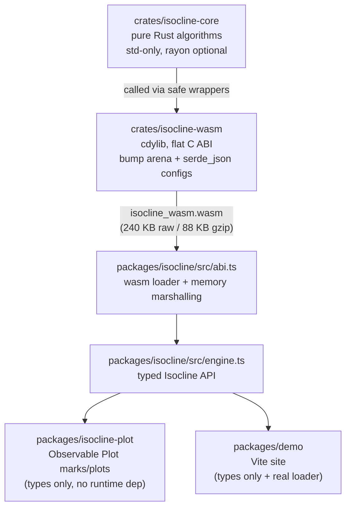

# Isocline Architecture

Isocline is a five-layer stack: a dependency-free Rust algorithm core, a
flat-ABI WASM binding, a TypeScript loader/marshalling layer, a typed engine
API, and two independent consumers. `CONTRACT.md` is the normative spec this
diagram describes.



Layer rules:

- `isocline-core` knows nothing about wasm or JS. It is testable with plain
  `cargo test` and reusable server-side (batch functions behind the
  `parallel` feature).
- `isocline-wasm` is a thin reconciliation layer: it parses snake_case JSON
  configs (serde, `deny_unknown_fields`), calls one core function per op,
  and packs results into a JSON header plus f64 channels.
- `abi.ts` owns all raw pointer handling; nothing above it touches wasm
  memory offsets.
- `engine.ts` maps the header JSON + channels onto the contract result types
  and enforces copying.
- `isocline-plot` imports only **types** from `isocline` - it has no runtime
  dependency on the engine, so it works with mocked results.

## Data flow for one call

Taking `forecast` as the example (`Abi.call` in `abi.ts`):

1. **TS engine** (`engine.ts`) fills option defaults and serializes the
   config to JSON with snake_case keys: `{"model":"auto","horizon":48,
   "period":null,"level":0.95,"paths":200,"seed":42}`. TS camelCase
   (`maxPeriod`) and the `"auto"` sentinel are translated here; `"auto"`
   becomes `null`.
2. **Copy in.** `Abi.call` calls `alloc` twice (config bytes, then the f64
   array) *before* writing either - a growth during the second alloc can
   relocate the arena and invalidate the first pointer - then writes the
   config bytes and a `Float64Array` copy of `y` into linear memory.
3. **`call(op, cfg_ptr, cfg_len, y_ptr, y_len)`** in wasm copies both
   buffers out, resets the bump arena, dispatches to the core op
   (`isocline_core::forecast`), and serializes a result header:
   `{"ok":true, ...op metadata..., "channels":{"point":[off,len],...}}`.
4. **Channels + header out.** Numeric outputs live as f64 arrays at
   8-aligned offsets; the header records their byte offsets and element
   counts. `json_ptr()/json_len()` expose the header string; `call` returns
   a status code (0 ok, 1 badConfig, 2 badOp, 3 tooShort, 4 badParams,
   5 internal).
5. **TS copies out.** `Abi.channel(header, name)` builds
   `Float64Array(memory.buffer, off, len)` **after** `call` returns and
   `.slice()`s immediately - the arena is only valid until the next `call`,
   and memory growth can detach the buffer. The engine then assembles the
   typed result (`ForecastResult`, `AnomalyResult`, ...) and throws
   `IsoclineError` on failure headers.

## Design decisions

| Decision | Rationale |
|---|---|
| Flat C ABI instead of wasm-bindgen | No JS runtime to pull in or generate; the module instantiates with an empty import object; plain `cargo build` produces the binary; total size 240 KB raw / 88 KB gzip (augurs is ~1 MB wasm). |
| Zero-dependency core (`std` only) | Deterministic, auditable algorithms; compiles anywhere; no transitive supply chain; `rayon` strictly opt-in behind `parallel` for server-side batching. |
| Bootstrap prediction intervals | One mechanism covers every model family (ETS, AR, snaive) uniformly; no distributional assumptions; empirically calibrated (coverage 0.88–1.0 at nominal 0.95 in the test gates). |
| Deterministic seeded RNG (xorshift, default seed 42) | Same inputs + seed → byte-identical outputs, verified by tests; reproducible CI and demos. |
| `rayon` behind a feature flag | Keeps the wasm build lean (single-threaded, small binary); `batch_forecast` / `batch_detect_anomalies` scale up on native targets with results identical to sequential runs. |
| JSON for config, binary for data | Configs are tiny scalar-only objects (snake_case keys, `null` for auto) - JSON is self-describing and cheap; the series and all numeric outputs are potentially large f64 arrays, so they cross the boundary as raw memory with an offset/length table in the header. |
| Copy in, copy out, caller-owned results | Input arrays are copied per call; outputs are `.slice()`ed out of the arena. No aliasing of wasm memory, so callers can hold results across calls safely. |
| `isocline-plot` types-only dependency | Plots work with any contract-shaped object (mocks, other engines); keeps the viz layer independently testable (`tsc --noEmit`) and tree-shakeable. |

## Contract-first, multi-agent build

The project was built by multiple agents working in parallel against
`CONTRACT.md` as the single source of truth. The contract was checked in
first and pinned the shared TypeScript types (`types.ts`), the WASM ABI
(op codes, status codes, channel naming, arena lifetime), the algorithm
behavior, and the theme tokens before any implementation existed. Each layer
was then implemented against the contract rather than against sibling code,
which is why the layers only meet at documented boundaries; when code and
contract disagree, the contract wins and the code is fixed.

## Regenerating everything

```sh
npm run build        # wasm (cargo build + copy) → tsc isocline → tsc plot → demo
npm run test:smoke   # loads the real wasm in Node, runs every op, asserts contract invariants
npm run test:rust    # cargo test --workspace (algorithm gates: period recovery, PI calibration, determinism, ...)
```

`npm run dev` serves the demo. The demo also has a `?mock=1` escape hatch
that swaps the real loader for a mock engine with the same interface.
