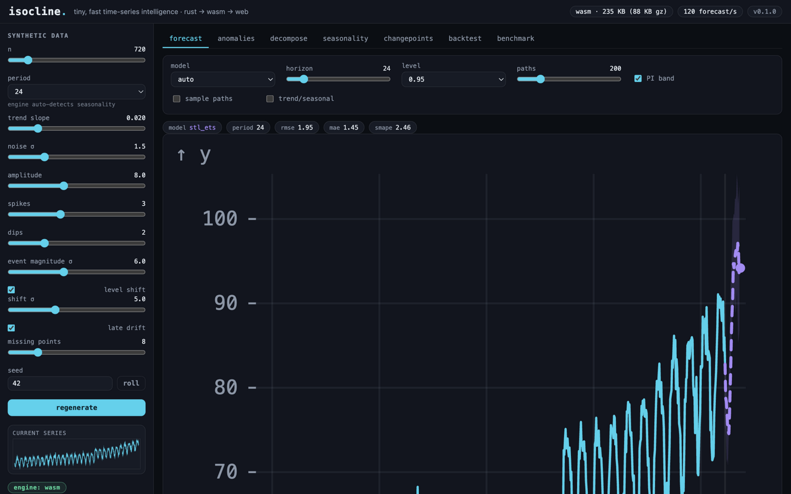
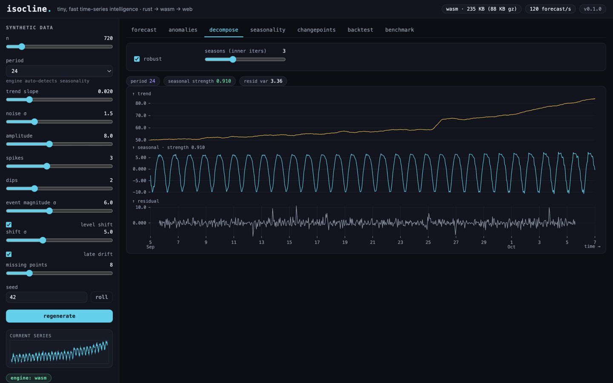
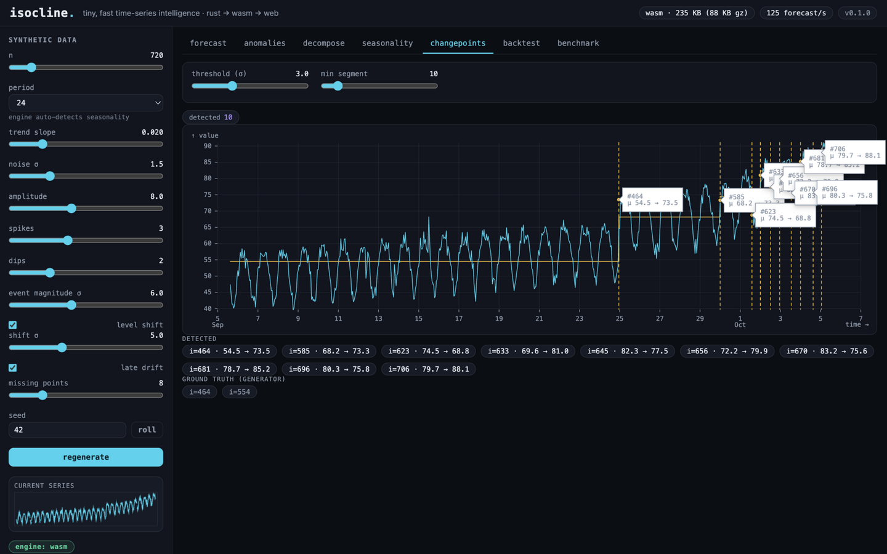

# Showcase

The product, in pictures. Every screenshot below is the real app running the
real wasm engine in-browser (engine pill says `wasm`, badges are measured at
runtime). Architecture diagram: [docs/architecture.html](architecture.html)
(also live on GitHub Pages).

## Forecast

Point forecast with 95% bootstrap prediction intervals. Auto model selection
resolved `stl_ets` with detected period 24; metrics chips show one-step
rmse / mae / smape.

The same forecast with the machinery exposed: 200-path bootstrap spaghetti,
projected trend (amber) and seasonal component (green).

## Anomaly detection

Robust-STL residual scoring. Injected events are flagged as spikes (red ▲) and
dips (blue ▼) against the amber expected-value line; the stats row scores the
detector against the generator's ground truth (precision / recall chips).

## Decomposition

Trend / seasonal / residual rows with seasonal strength readout.

## Seasonality

Autocorrelation (with confidence band) and the periodogram on a log-period
axis; the best period is annotated on both panels.

## Changepoints

Binary segmentation: step means (amber) over the series with rules at each
detected shift.

## Backtest

Rolling-origin evaluation of four models × three folds, sortable leaderboard
plus the metric heatmap. `stl_ets` wins on this series.

## Benchmarks

Live-measured in the browser tab you are looking at (single-threaded wasm,
M-series laptop): forecast 8 ms at n=1k, 252 ms at n=50k, against a pure-JS
seasonal-naive baseline for reference.

| op | n | time (browser, live) |
|---|---|---|
| forecast (stl_ets, h=48, 200 paths) | 1,000 | 8 ms |
| forecast | 10,000 | 83 ms |
| forecast | 50,000 | 252 ms |
| anomalies (stl) | 10,000 | 57 ms |
| decompose | 10,000 | 52 ms |
| seasonality | 10,000 | 14 ms |
| snaive in plain JS (reference) | 50,000 | 4.4 ms |
